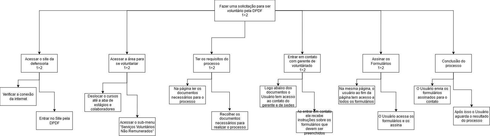
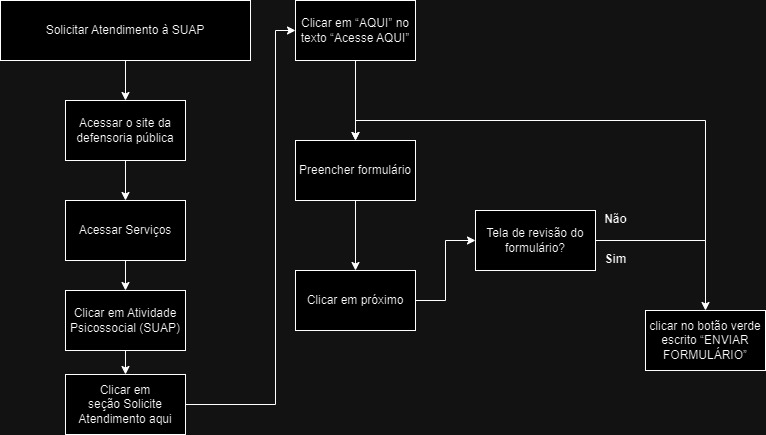

# **Análise de Tarefas para o Site da Defensoria Pública do Distrito Federal (DPDF)**

|    Data    | Data Prevista de Revisão | Versão |           Descrição            |                                                                                 Autor                                                                                 |                     Revisor                      |
| :--------: | :----------------------: | :----: | :----------------------------: | :-------------------------------------------------------------------------------------------------------------------------------------------------------------------: | :----------------------------------------------: |
| 01/12/2024 |        02/12/2024        |  1.0   |      Criação do Documento      | [João Victor C. Nobre](https://github.com/Gam13)   [Karolina Vieira](https://github.com/Karolina91)  [Paola Nascimento](https://github.com/paolaalim) |   [Lucas Sales](https://github.com/Lux-Sales)    |
| 02/12/2024 |        02/12/2024        |  1.1   | Adição do histórico de versões |                                                              [Lucas Sales](https://github.com/Lux-Sales)                                                              | [João Victor C. Nobre](https://github.com/Gam13) |
| 02/12/2024 |        02/12/2024        |  1.2   |      Adição da tarefa 04       |                                                              [Lucas Sales](https://github.com/Lux-Sales)                                                              | [João Victor C. Nobre](https://github.com/Gam13) |

## **Objetivos, Operadores, Métodos e Regras de Seleção (GOMS)**

A metodologia GOMS (Goals, Operators, Methods, and Selection Rules) é usada para detalhar as ações necessárias para concluir tarefas no site da DPDF. Abaixo, apresentamos a análise de tarefas realizadas no site:

---

## **Tarefa 1: Acompanhar a Resposta de uma Solicitação**

 **Goal 0:** Verificar o status de uma solicitação no site da Defensoria Pública

 **Method 1:** Passos para acessar e consultar o status da solicitação

 **Goal 1:** Conectar-se à rede Wi-Fi
- **OP 1.1:** Ligar o computador.
- **OP 1.2:** Conectar à rede Wi-Fi desejada.

 **Goal 2:** Acessar o site da Defensoria Pública
- **OP 2.1:** Abrir o navegador de internet (ex.: Google Chrome).
- **OP 2.2:** Digitar o endereço do site.
- **OP 2.3:** Pressionar *Enter* para carregar o site.

 **Goal 3:** Localizar a área de acompanhamento de solicitações
 **Method 1:** Usar o menu principal do site
- **OP 3.1:** Navegar pelo menu principal.
- **OP 3.2:** Identificar e clicar na seção "Acompanhamento de Solicitações".

 **Method 2:** Usar a barra de busca
- **OP 3.3:** Localizar a barra de busca no site.
- **OP 3.4:** Digitar "Acompanhamento de Solicitações" e pressionar *Enter*.
- **OP 3.5:** Analisar os resultados e clicar no link apropriado.

 **Goal 4:** Verificar o status da solicitação
- **OP 4.1:** Inserir as informações solicitadas (ex.: número do protocolo ou CPF).
- **OP 4.2:** Clicar no botão para consultar o status.
- **OP 4.3:** Aguardar o carregamento da página com as informações.

 **Goal 5:** Concluir a verificação
- **OP 5.1:** Ler e interpretar as informações apresentadas.
- **OP 5.2:** Capturar a tela ou anotar os detalhes relevantes.

---

## **Diagrama HTA – Acompanhar a Resposta de uma Solicitação**

---
## **Tarefa 2: Utilizar o Chatbot para Assistência**

 **Goal 0:** Utilizar o chatbot para assistência

 **Method 1:** Interagir com o chatbot para obter assistência

 **Goal 1:** Iniciar a interação com o chatbot
- **OP 1.1:** Deslocar o cursor até o ícone do chatbot.
- **OP 1.2:** Clicar no ícone para abrir a janela de chat.

 **Goal 2:** Escolher a opção desejada entre as alternativas apresentadas
- **OP 2.1:** Clicar em uma das opções apresentadas pelo chatbot.

 **Goal 3:** Navegar pelo chatbot
- **OP 3.1:** Clicar no botão "Voltar" para retornar ao menu anterior.
- **OP 3.2:** Clicar no botão "Menu Principal" para voltar às opções iniciais.

 **Goal 4:** Obter a resposta final
- **OP 4.1:** Ler as instruções fornecidas ou clicar no link redirecionado.

---

## **Diagrama HTA – Utilizar o Chatbot**

---

## **Tarefa 3: Adquirir e Preencher o Formulário para Voluntariado**

 **Goal 0:** Participar como voluntário na DPDF

 **Method 1:** Adquirir e preencher o formulário de voluntariado

 **Goal 1:** Acessar o site
- **OP 1.1:** Verificar a conexão de internet.
- **OP 1.2:** Acessar a página principal da DPDF.

 **Goal 2:** Acessar a área correspondente para voluntariado
- **OP 2.1:** Navegar até a aba de "Estágios ou Colaboradores".
- **OP 2.2:** Selecionar "Serviços Voluntários Não Remunerados".

 **Goal 3:** Consultar os requisitos para o processo
- **OP 3.1:** Ler os documentos necessários.
- **OP 3.2:** Recolher os documentos.

 **Goal 4:** Contatar o gerente de voluntariado
- **OP 4.1:** Localizar os contatos do gerente na página.
- **OP 4.2:** Solicitar informações e orientações.

 **Goal 5:** Preencher os formulários
 **Method 1:** Assinatura Digital
- **OP 5.1.1:** Acessar e preencher os formulários online.
- **OP 5.1.2:** Assinar digitalmente.

 **Method 2:** Assinatura Física
- **OP 5.2.1:** Imprimir os formulários.
- **OP 5.2.2:** Assinar fisicamente.

**Goal 6:** Concluir o envio
- **OP 6.1:** Submeter os documentos preenchidos.
- **OP 6.2:** Aguardar a resposta.

---
## **Diagrama HTA – Adquirir e Preencher Formulário para Voluntariado**

## Tarefa 4: Solicitar atendimento à SUAP 

**Goal 0: Solicitar atendimento à SUAP**
**Method 1:** Solicitar atendimento via internet

**OP 1.1** Acessar o site da defensoria pública  
**OP 1.2** Deslocar mouse até a aba “Serviços”  
**OP 1.3** Dentro de Serviços, clicar em “Atividade Psicossocial (SUAP)”  
**OP 1.4** Rolar a página para baixo, até a seção “Solicite Atendimento  aqui”  
**OP 1.5** Clicar em “AQUI” no texto “Acesse AQUI”  
**OP 1.6** Preencher formulário e clicar em próximo até chegar a uma  página de revisão dos dados 
**OP 1.7** Após finalizar a revisão dos dados, clicar no botão verde  escrito “ENVIAR FORMULÁRIO” 

