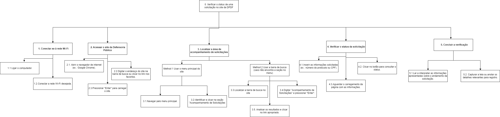

# **Análise de Tarefas para o Site da Defensoria Pública do Distrito Federal (DPDF)**

## **Objetivos, Operadores, Métodos e Regras de Seleção (GOMS)**

A metodologia GOMS (Goals, Operators, Methods, and Selection Rules) é usada para detalhar as ações necessárias para concluir tarefas no site da DPDF. Abaixo, apresentamos a análise de tarefas realizadas no site:

---

### **Tarefa 1: Acompanhar a Resposta de uma Solicitação**

#### **Goal 0:** Verificar o status de uma solicitação no site da Defensoria Pública

#### **Method 1:** Passos para acessar e consultar o status da solicitação

##### **Goal 1:** Conectar-se à rede Wi-Fi
- **OP 1.1:** Ligar o computador.
- **OP 1.2:** Conectar à rede Wi-Fi desejada.

##### **Goal 2:** Acessar o site da Defensoria Pública
- **OP 2.1:** Abrir o navegador de internet (ex.: Google Chrome).
- **OP 2.2:** Digitar o endereço do site.
- **OP 2.3:** Pressionar *Enter* para carregar o site.

##### **Goal 3:** Localizar a área de acompanhamento de solicitações
###### **Method 1:** Usar o menu principal do site
- **OP 3.1:** Navegar pelo menu principal.
- **OP 3.2:** Identificar e clicar na seção "Acompanhamento de Solicitações".

###### **Method 2:** Usar a barra de busca
- **OP 3.3:** Localizar a barra de busca no site.
- **OP 3.4:** Digitar "Acompanhamento de Solicitações" e pressionar *Enter*.
- **OP 3.5:** Analisar os resultados e clicar no link apropriado.

##### **Goal 4:** Verificar o status da solicitação
- **OP 4.1:** Inserir as informações solicitadas (ex.: número do protocolo ou CPF).
- **OP 4.2:** Clicar no botão para consultar o status.
- **OP 4.3:** Aguardar o carregamento da página com as informações.

##### **Goal 5:** Concluir a verificação
- **OP 5.1:** Ler e interpretar as informações apresentadas.
- **OP 5.2:** Capturar a tela ou anotar os detalhes relevantes.

---

### **Diagrama HTA – Acompanhar a Resposta de uma Solicitação**

 
*Figura 1 - Diagrama HTA da tarefa "Acompanhar a Resposta de uma Solicitação"*

---

### **Tarefa 2: Utilizar o Chatbot para Assistência**

#### **Goal 0:** Utilizar o chatbot para assistência

#### **Method 1:** Interagir com o chatbot para obter assistência

##### **Goal 1:** Iniciar a interação com o chatbot
- **OP 1.1:** Deslocar o cursor até o ícone do chatbot.
- **OP 1.2:** Clicar no ícone para abrir a janela de chat.

##### **Goal 2:** Escolher a opção desejada entre as alternativas apresentadas
- **OP 2.1:** Clicar em uma das opções apresentadas pelo chatbot.

##### **Goal 3:** Navegar pelo chatbot
- **OP 3.1:** Clicar no botão "Voltar" para retornar ao menu anterior.
- **OP 3.2:** Clicar no botão "Menu Principal" para voltar às opções iniciais.

##### Goal 4: Obter a resposta final do chatbot
- **OP 4.1:** Ler a resposta final com instruções fornecidas ou um link clicável para redirecionamento
- **OP 4.2:** Clicar no link para redirecionamento

## Diagrama HTA (Hierarchical Task Analysis)

### Tarefa: Utilizar o Chatbot para Assistência

