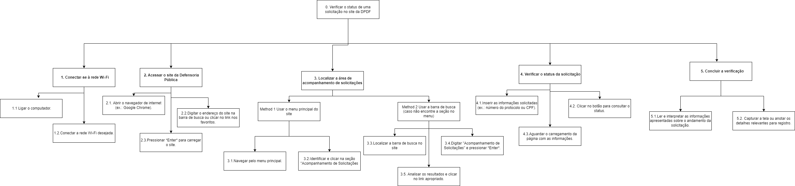

# Análise de Tarefas para o Site da Defensoria Pública do Distrito Federal (DPDF)

## Objetivos, Operadores, Métodos e Regras de Seleção (GOMS)

A metodologia GOMS (Goals, Operators, Methods, and Selection Rules) é utilizada para analisar o desempenho dos usuários ao realizarem tarefas em sistemas computacionais. Aqui, detalhamos a análise GOMS para algumas das principais tarefas realizadas no site da DPDF.

### Tarefa: Acompanhar a Resposta de uma Solicitação
# Análise GOMS: Verificar o status de uma solicitação no site da Defensoria Pública

## **Goal 0**: Verificar o status de uma solicitação no site da Defensoria Pública

### **Method 1**: Realizar os passos necessários para acessar e consultar o status da solicitação.

---

## **Goal 1**: Conectar-se à rede Wi-Fi
- **OP 1.1**: Ligar o computador.
- **OP 1.2**: Conectar a rede Wi-Fi desejada.

---

## **Goal 2**: Acessar o site da Defensoria Pública
- **OP 2.1**: Abrir o navegador de internet (ex.: Google Chrome).
- **OP 2.2**: Digitar o endereço do site na barra de busca ou clicar no link nos favoritos.
- **OP 2.3**: Pressionar *Enter* para carregar o site.

---

## **Goal 3**: Localizar a área de acompanhamento de solicitações

### **Method 1**: Usar o menu principal do site
- **OP 3.1**: Navegar pelo menu principal.
- **OP 3.2**: Identificar e clicar na seção "Acompanhamento de Solicitações".

### **Method 2**: Usar a barra de busca (caso não encontre a seção no menu)
- **OP 3.3**: Localizar a barra de busca no site.
- **OP 3.4**: Digitar "Acompanhamento de Solicitações" e pressionar *Enter*.
- **OP 3.5**: Analisar os resultados e clicar no link apropriado.

---

## **Goal 4**: Verificar o status da solicitação
- **OP 4.1**: Inserir as informações solicitadas (ex.: número do protocolo ou CPF).
- **OP 4.2**: Clicar no botão para consultar o status.
- **OP 4.3**: Aguardar o carregamento da página com as informações.

---

## **Goal 5**: Concluir a verificação
- **OP 5.1**: Ler e interpretar as informações apresentadas sobre o andamento da solicitação.
- **OP 5.2**: Capturar a tela ou anotar os detalhes relevantes para registro.

---

## **Regras de Seleção**
1. Caso a seção "Acompanhamento de Solicitações" esteja disponível no menu principal, utilize o **Method 1**.
2. Caso não encontre a seção no menu, utilize a barra de busca, seguindo o **Method 2**.
3. Para registrar informações, escolha entre capturar a tela ou anotar os detalhes relevantes, dependendo da conveniência e recursos disponíveis.

   ## Diagrama HTA (Hierarchical Task Analysis)

### Tarefa: Acompanhar a Resposta de uma Solicitação

## Conclusão
A aplicação das metodologias GOMS e HTA na análise de tarefas do site da Defensoria Pública do Distrito Federal (DPDF) evidencia os passos essenciais para que os usuários alcancem seus objetivos, como acessar informações jurídicas e requisitar assistência legal. Essa abordagem não apenas descreve as ações realizadas pelos usuários, mas também aponta possíveis melhorias na usabilidade do site. A adoção de sugestões fundamentadas nessa análise pode melhorar consideravelmente a experiência do usuário, tornando o site mais prático e funcional.

