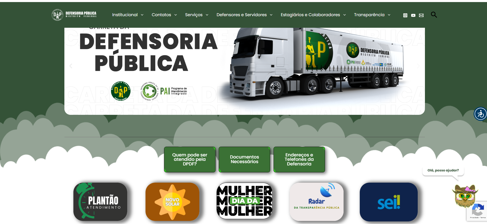
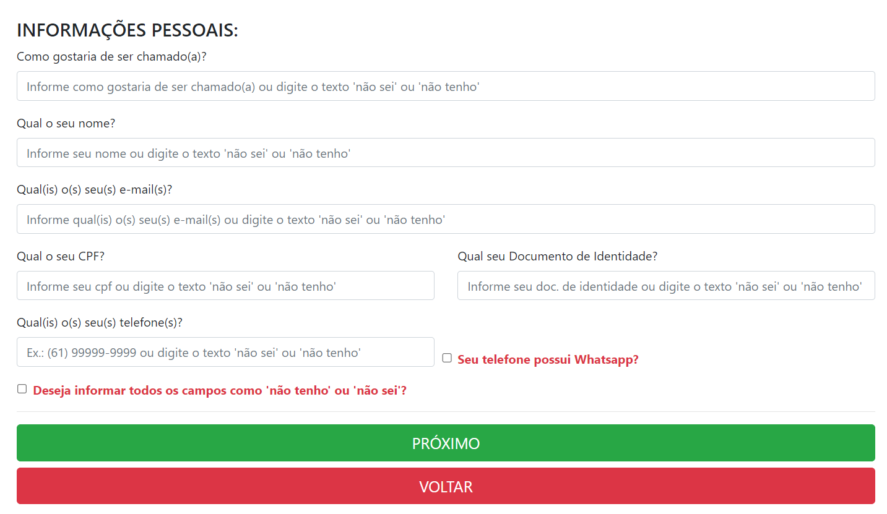
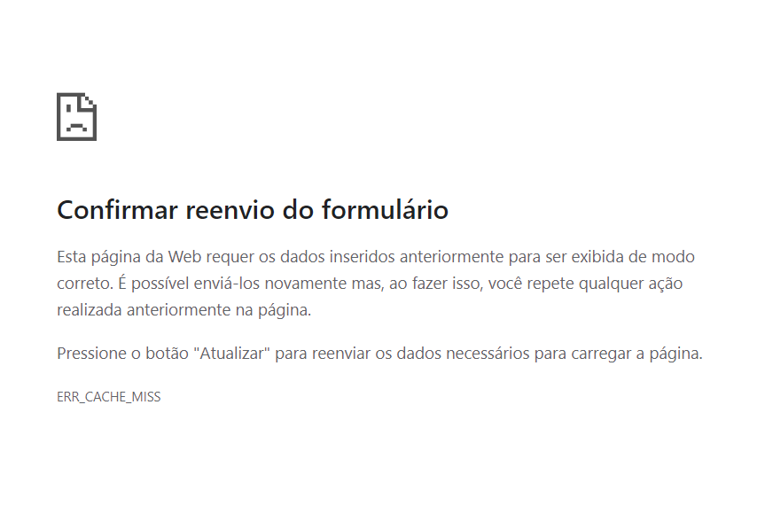
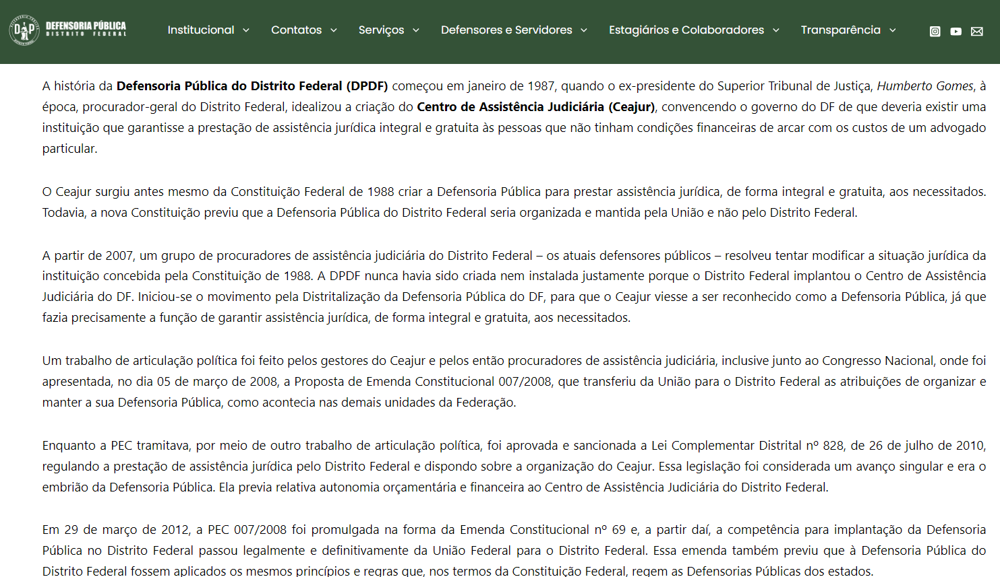

# **Princípios Gerais**
### **Histórico de Versão**
|    Data    | Data Prevista de Revisão | Versão |      Descrição       |                    Autor                    |                     Revisor                      |
| :--------: | :----------------------: | :----: | :------------------: | :-----------------------------------------: | :----------------------------------------------: |
| 20/11/2024 |        21/11/2024        |  1.0   | Criação do Documento | [Karolina Vieira](https://github.com/Karolina91) | [João Victor C. Nobre](https://github.com/Gam13)  |

## **Introdução**  
O objetivo deste documento é analisar a interação do usuário com o site da Defensoria Pública, avaliando como os **Princípios e Diretrizes Gerais** da Interação Humano-Computador (IHC) podem ser aplicados. A estruturação do site deve garantir usabilidade, acessibilidade, eficiência e um feedback efetivo, proporcionando uma experiência que atenda às necessidades dos usuários.

Baseando-se no livro *Interação Humano-Computador* (S. D. J. Barbosa, B. S. da Silva) [1], os princípios descritos aqui serão analisados no contexto do site, com a identificação de violações e sugestões de melhorias.

---

## **Princípios e Diretrizes Gerais**

### **Correspondência com as Expectativas dos Usuários**  
Refere-se à necessidade de o sistema se alinhar às expectativas e ao modelo mental dos usuários, utilizando terminologias, representações e fluxos de interação familiares. Sistemas que atendem a este princípio são intuitivos e reduzem a carga cognitiva.

### **Análise**
O site da Defensoria Pública apresenta menus e nomenclaturas que não correspondem às expectativas naturais dos usuários. Por exemplo, ao acessar o menu principal, um usuário comum provavelmente busca opções claras e diretas como “Atendimento”, “Serviços Jurídicos” ou “Contato”. No entanto, ao encontrar termos como “Sistemas Internos”, que são mais adequados ao público técnico ou interno da organização, o usuário pode sentir confusão ou frustração.

Essa desconexão entre a linguagem do site e a forma como os usuários compreendem as funções prejudica a experiência, tornando a navegação menos eficiente e aumentando a carga cognitiva. Para um site voltado ao público geral, é essencial priorizar clareza e acessibilidade na organização e nomeação dos menus.

 

---

### **Simplicidade nas Estruturas das Tarefas**  
Busca reduzir a complexidade das tarefas, dividindo-as em etapas claras e eliminando elementos ou processos desnecessários. Isso facilita a compreensão e execução das ações, minimizando o esforço do usuário.

### **Análise**
Embora o site da Defensoria Pública disponibilize um formulário de solicitação de atendimento simplificado, ele apresenta uma falta de instruções claras para o preenchimento. Essa ausência pode gerar dúvidas, especialmente entre usuários menos experientes, resultando em erros ou até na desistência do preenchimento.

 

---

### **Equilíbrio entre Controle e Liberdade do Usuário** 
Este princípio enfatiza que o sistema deve oferecer ao usuário liberdade para corrigir erros ou tomar decisões, sem impor restrições desnecessárias. Deve-se permitir ações como desfazer, refazer ou retornar etapas, promovendo flexibilidade.

### **Análise**
O site da Defensoria Pública apresenta uma limitação importante nesse aspecto, particularmente em formulários. Atualmente, não há uma opção visível ou intuitiva para salvar rascunhos ou desfazer alterações feitas durante o preenchimento. Essa ausência força o usuário a completar o formulário em uma única sessão ou, em caso de erros, reiniciar o processo desde o início.

Isso não só aumenta a carga de trabalho, mas também desestimula o uso do sistema em situações onde a interrupção do processo é inevitável. A falta de flexibilidade pode levar usuários a abandonar o preenchimento de formulários longos ou a cometer erros que não podem ser facilmente

 

---

### **Consistência e Padronização**  
Envolve a uniformidade nos elementos de interface e interação, garantindo que o comportamento seja previsível. Por exemplo, botões semelhantes devem ter aparência e funcionamento idênticos, aumentando a confiança do usuário.

### **Análise**
No site da Defensoria Pública, a inconsistência nos botões de envio representa uma falha no cumprimento desses princípios. Foram observados estilos visuais distintos para botões que desempenham a mesma função, como mudanças na cor, tamanho ou formato. Essas variações podem confundir os usuários, fazendo com que eles hesitem ou demorem mais para completar tarefas simples.

 

### **Promovendo a Eficiência do Usuário**  
Concentra-se em otimizar a interação, tornando-a rápida e responsiva. Ferramentas como atalhos, preenchimento automático e feedback em tempo real ajudam a reduzir o tempo e esforço necessários para alcançar os objetivos.

### **Análise**
Embora o site demonstre uma interface geralmente responsiva, há lacunas significativas que comprometem a eficiência do usuário. Um dos problemas observados é a lentidão no carregamento de páginas. Essa situação é agravada pela ausência de feedback adequado, como barras de progresso ou mensagens informativas, que deixariam claro ao usuário que a ação está sendo processada. A ausência de feedback pode causar incertezas, levando o usuário a acreditar que o sistema está travado ou que sua solicitação não foi registrada, o que frequentemente resulta em ações repetidas ou abandono da tarefa.

---

### **Antecipação**  
Trata-se de prever as necessidades do usuário e fornecer soluções proativas. Isso inclui funcionalidades como sugestões de preenchimento, ações predefinidas ou dicas contextuais que facilitam a interação.

### **Análise**
O site da Defensoria Pública carece de funcionalidades proativas que antecipem as necessidades do usuário, como preenchimento automático ou ações predefinidas. Por exemplo, ao acessar o histórico de atendimentos, os filtros de busca não possuem valores padrão, exigindo que o usuário preencha manualmente todas as opções. Essa falta de automação aumenta o esforço cognitivo e pode tornar a interação mais demorada e menos eficiente

---

### **Visibilidade e Reconhecimento**  
Destaca a importância de tornar as opções e informações visíveis e acessíveis. O usuário deve reconhecer facilmente os elementos interativos e saber quais ações são possíveis, sem a necessidade de memorização.

### **Análise**
O site da Defensoria Pública apresenta desafios relacionados à visibilidade e reconhecimento dos elementos interativos. Embora ações principais, como “Agendar Atendimento”, sejam destacadas, opções secundárias acabam se perdendo no design, prejudicando a navegação. A falta de hierarquia visual clara, contraste adequado e feedback interativo dificulta o reconhecimento e uso eficiente das funcionalidades

---

### **Conteúdo Relevante e Expressão Adequada**  
Envolve apresentar informações claras, concisas e apropriadas ao público-alvo. Linguagem técnica ou complexa deve ser traduzida para termos simples, garantindo que o conteúdo seja compreendido por todos os usuários.

### **Análise**

O site da Defensoria Pública enfrenta desafios com o uso de textos longos e linguagem jurídica complexa, dificultando a compreensão e interação do público-alvo, que é diversificado e muitas vezes leigo em termos técnicos. A falta de explicações adicionais para conceitos jurídicos pode gerar barreiras de acesso, frustrar usuários e comprometer a experiência de navegação. Para melhorar, é essencial adotar uma comunicação clara e acessível, traduzindo termos técnicos para linguagem simples e estruturando o conteúdo de forma objetiva, com recursos como glossários, parágrafos curtos e títulos explicativos. Essas medidas promovem inclusão, acessibilidade e eficiência no uso do site.

 

### **Projeto para Erros**  
Foca em minimizar a ocorrência de erros e oferecer suporte claro quando eles acontecem. Mensagens de erro devem ser informativas e orientadoras, indicando o problema e sugerindo ações corretivas.

### **Análise**
O site da Defensoria Pública não fornece feedback detalhado quando o usuário comete erros ao preencher um formulário. Ao enviar dados incorretos, o sistema exibe uma mensagem genérica de erro, mas não especifica qual campo contém o problema. Isso pode causar frustração no usuário e aumentar o tempo necessário para concluir o preenchimento.

 

## **Conclusão**  
Com base nos princípios apresentados, é possível aprimorar a interação do usuário com o site da Defensoria Pública, tornando-o mais acessível, eficiente e alinhado às expectativas do público. Implementar essas melhorias resultará em uma experiência mais satisfatória e funcional.

## Referências  

1. BARBOSA, S. D. J.; SILVA, B. S. *Interação Humano-Computador*. Rio de Janeiro: Elsevier, 2011.  
