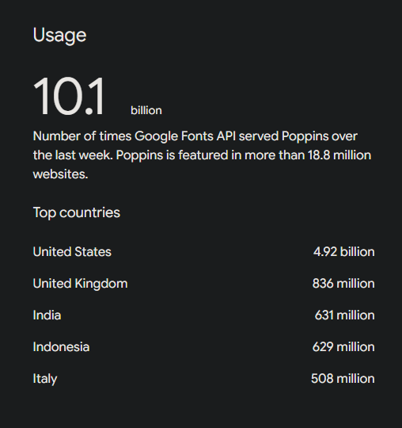
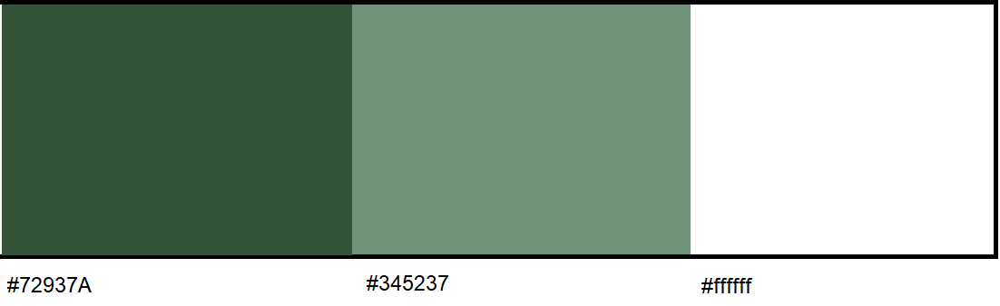
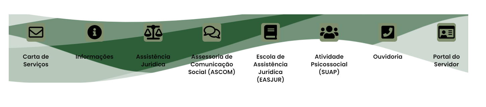
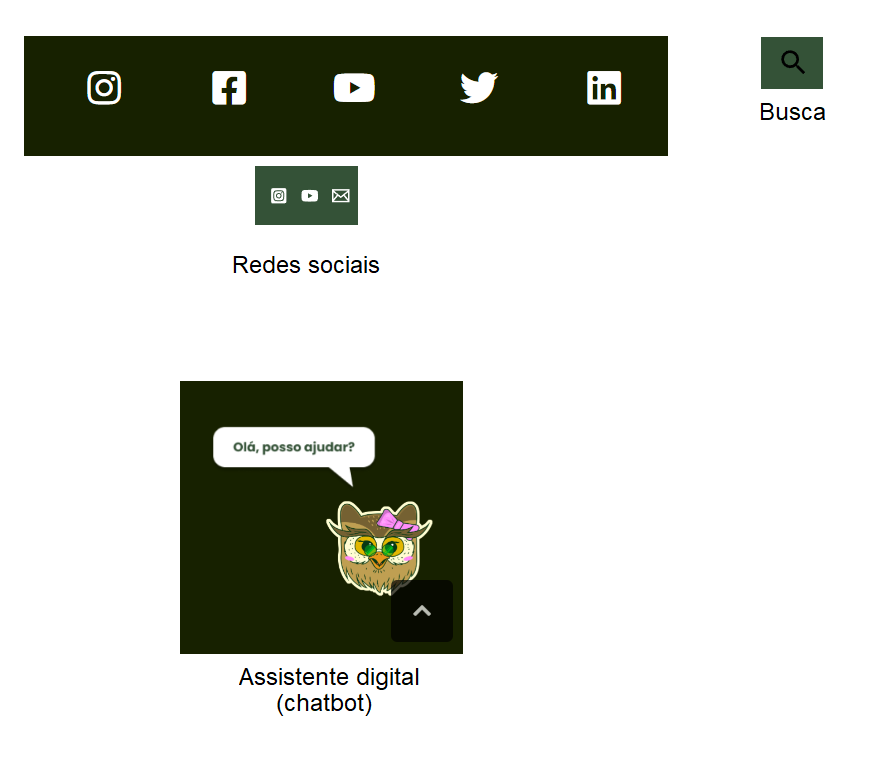

## Histórico de Versão
|    Data    | Data Prevista de Revisão | Versão |      Descrição       |                    Autor                    |                     Revisor                      |
| :--------: | :----------------------: | :----: | :------------------: | :-----------------------------------------: | :----------------------------------------------: |
| 02/12/2024 |        02/12/2024        |  1.0   | Criação do Documento | [Lucas Sales](https://github.com/Lux-Sales) | [João Victor C. Nobre](https://github.com/Gam13) |

## Introdução

O guia de estilo é um documento que visa registrar as principais decisões de design tomadas, com esse registro, tais decisões não se perdem ao longo do desenvolvimento do sistema, o que garante que estas se farão presentes no produto final, o guia de estilo também serve de ferramenta de comunicação entre a equipe de design e a de desenvolvimento. Para a equipe de design, tal artefato também se mostra muito importante, uma vez que as decisões podem ser facilmente consultadas e reutilizadas no produto a ser desenvolvido, versões futuras, questões de temas e etc.

Barbosa (2021) diz que um guia de estilo deve incorporar decisões de design envolvendo os principais elementos e considerações de design de interface. Marcus (1991) considera os seguintes elementos:

• layout: proporção e grids; uso de metáforas espaciais; design gráfico de exibidores e ferramentas;
• tipografia e seu uso em diálogos, formulários e relatórios;
• simbolismo: clareza e consistência no design de ícones;
• cores: os dez mandamentos sobre o uso de cores;
• visualização de informação: design de gráficos, diagramas e mapas;
• design de telas e elementos de interface (widgets).

Marcus (1991) e Mayhew (1999) sugerem uma comum estrutura de guia de estilo, no qual foi utilizada juntamente com a estrutura da análise do site Simples Nacional [2], como base para se desenvolver uma de seguinte formato:

1. Introdução
• Objetivo do guia de estilo
• Público-alvo do guia de estilos (programadores, gerentes, equipe de suporte)
• Como utilizar o guia (em produção e manutenção)
• Como manter o guia	
2. Elementos de interface
Logotipo
• Tipografia
• Cores
Ícones

## Objetivo

Documentar e analisar decisões de design do site da Defensoria Pública do Distrito Federal, servindo de apoio para futuras atividades de uma avaliação de IHC.

## Público alvo

Os alunos do grupo 02 de Interação Humano Computador da Universidade de Brasília, do ano de 2024, segundo semestre.

## Como utilizar o guia

Este guia deve ser consultado sempre que necessário para realização de atividades da disciplina de IHC

## Como manter o guia

Sempre que uma atualização neste documento for feita, a mesma deverá ser incluída no histórico de versões.

## Elementos da Interface

### Logotipo

 

<i>
Figura 1 - Logotipo
</i>

### Tipografia

Analisando os elementos de texto por meio da ferramenta de inspeção do próprio navegador, descobriu-se que a fonte utilizada na página é a Poppins.

Uma fonte geométrica sem serifa, com suporte para os sistemas de escrita Devanagari e Latino.

 

<i>
Figura 2 - Dados da fonte Poppins
</i>

### Cores

 

<i>
Figura 3 - Paleta de cores
</i>

### Ícones

 

<i>
Figura 4 - Ícones
</i>

 

<i>
Figura 5 - Ícones
</i>

 

<i>
Figura 6 - Ícones
</i>

# Bibliografia

[1] BARBOSA, S. et al. Interação Humano-Computador e Experiência do Usuário. [s.l.] Autopublicação - Leanpub, 2021.

[2] Análise da plataforma Simples Nacional - Características da plataforma, disponível em:https://interacao-humano-computador.github.io/2022.2-SimplesNacional/Tarefas/GuiaDeEstilo/. Acesso em 01 de dezembro de 2024.

[3] Google Fonts - Poppins, disponível em: https://fonts.google.com/specimen/Poppins/about. Acesso em 02 de dezembro de 2024