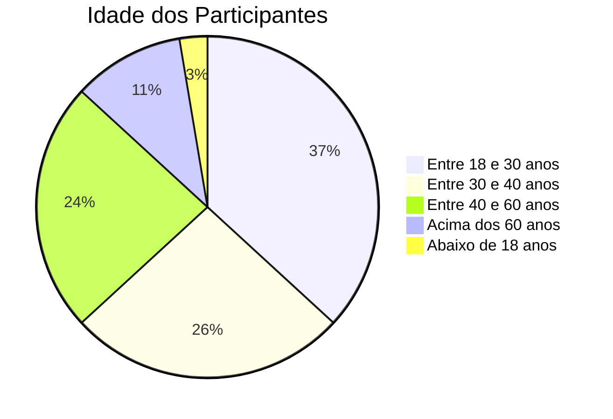
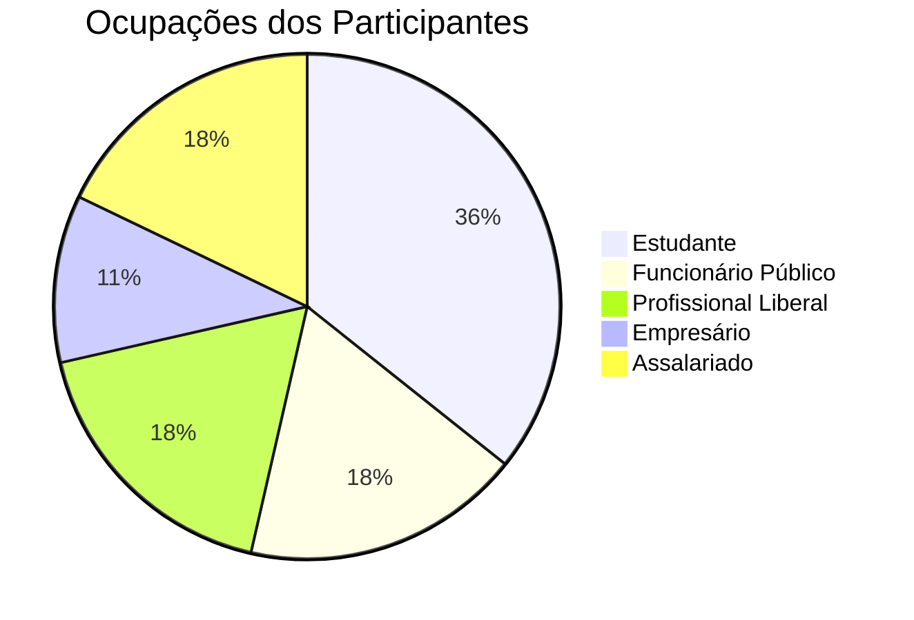
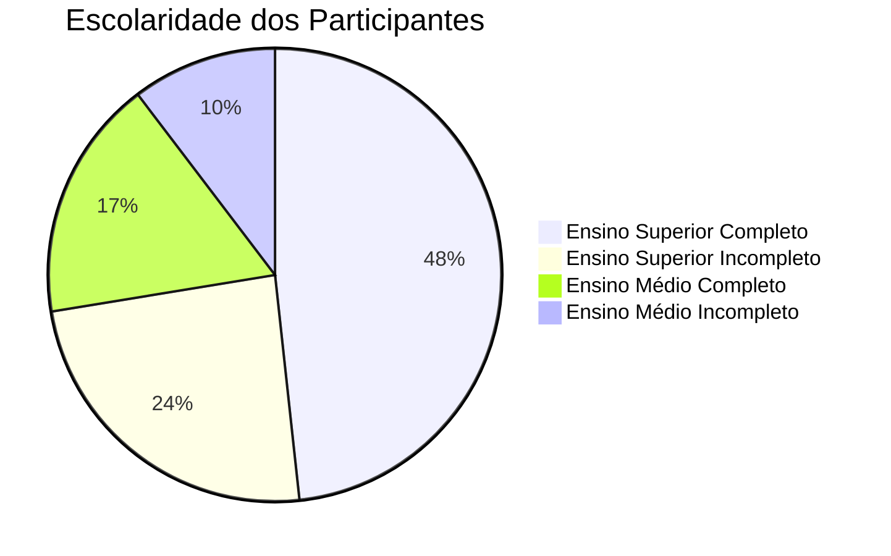
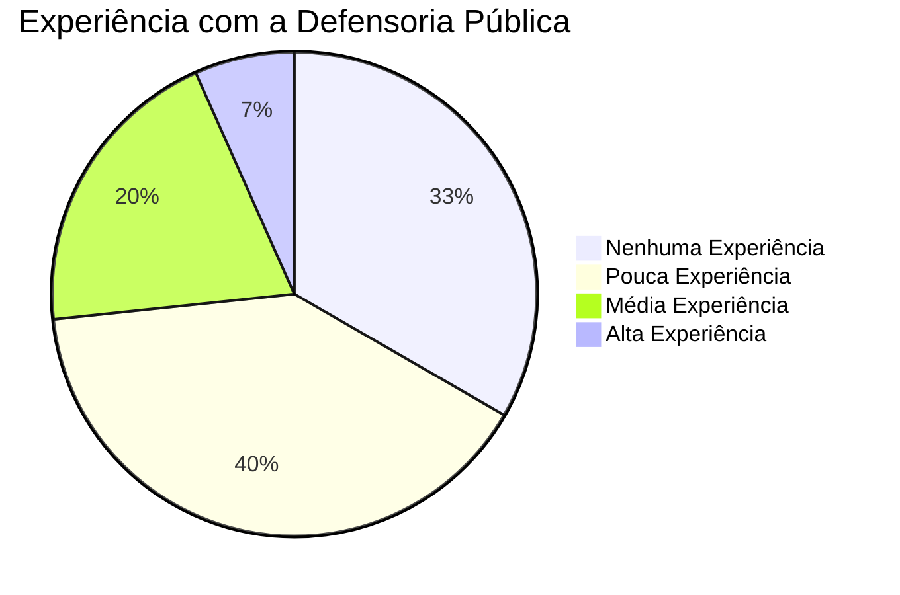
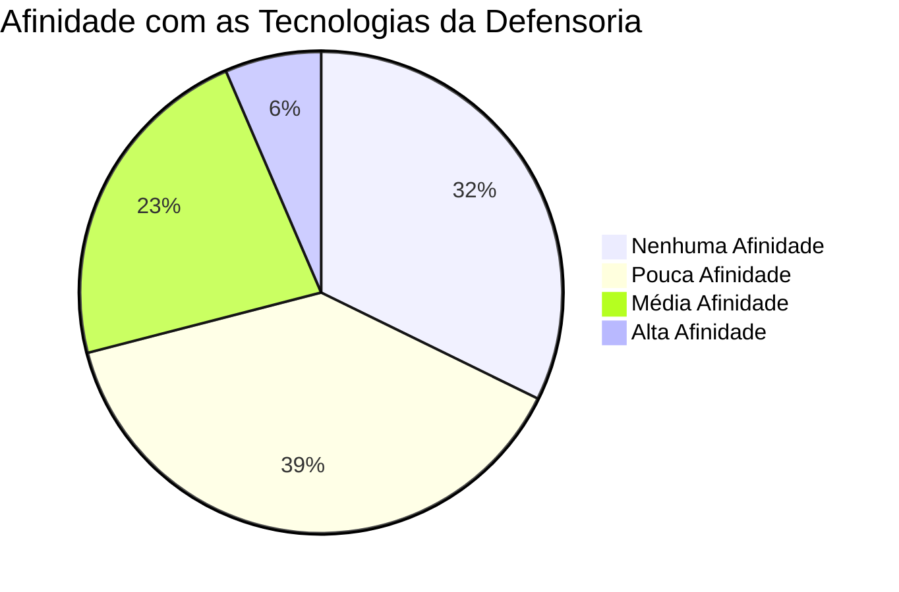
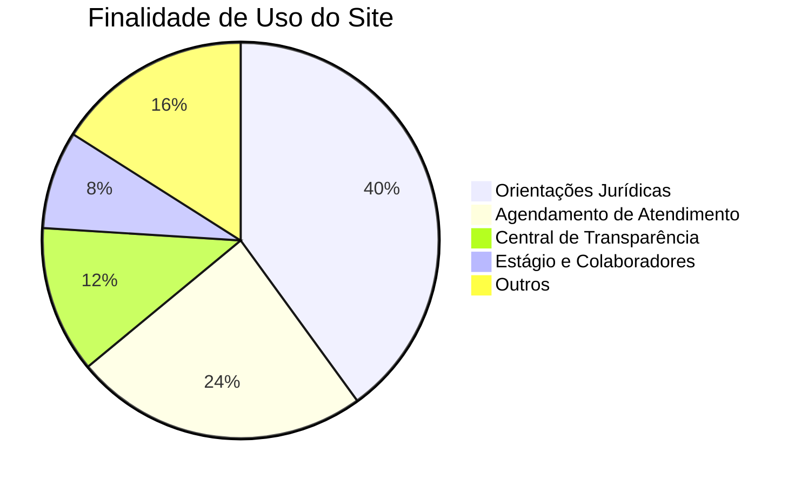
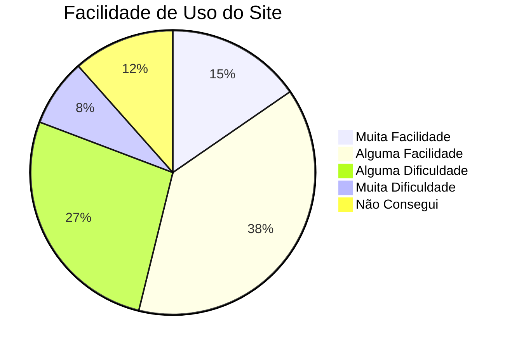
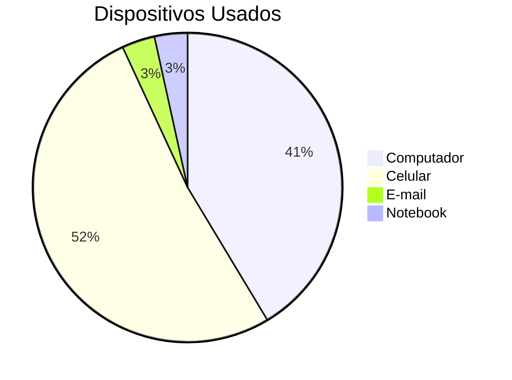
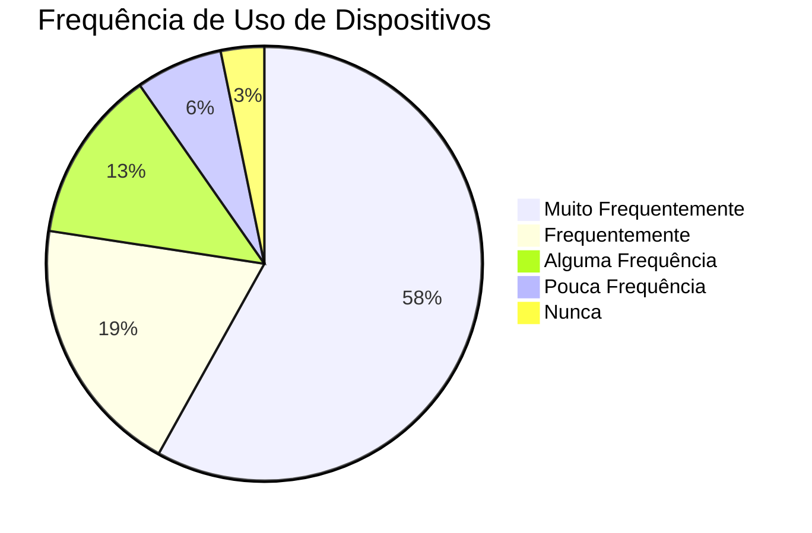

## **Perfil do Usuário da Defensoria Pública do Distrito Federal**

### **Histórico de Versão**
|    Data    | Data Prevista de Revisão | Versão |      Descrição       |                    Autor                    |                     Revisor                      |
| :--------: | :----------------------: | :----: | :------------------: | :-----------------------------------------: | :----------------------------------------------: |
| 29/11/2024 |        30/11/2024        |  1.0   | Criação do Documento | [João Victor C. Nobre](https://github.com/Gam13) | [Lucas Sales](https://github.com/Lux-Sales)  |

---

### **Objetivo da Pesquisa**
Esta pesquisa tem como objetivo entender o perfil dos usuários do site da Defensoria Pública do Distrito Federal, explorando a experiência dos usuários com a acessibilidade, usabilidade e a tecnologia utilizada pelo serviço. A seguir, apresentamos os resultados da pesquisa.

---
### **Perfil do Usuário da Defensoria Pública do Distrito Federal**

### **Resultados**

Os resultados obtidos através da pesquisa e do questionário são consistentes, revelando semelhanças entre os métodos aplicados. O questionário incluiu perguntas específicas que podem ser vistas na Tabela 1:

**Tabela 1 - Perguntas do Formulário Eletrônico**

| Número | Pergunta                                    |
|--------|--------------------------------------------|
| 1      | Qual a sua idade?                          |
| 2      | Qual o seu sexo?                           |
| 3      | Qual a sua escolaridade?                   |
| 4      | Qual a sua experiência com a Defensoria Pública? |
| 5      | Qual a sua afinidade com tecnologia?       |
| 6      | Principal motivo para utilizar os serviços da Defensoria Pública? |
| 7      | Qual dispositivo você mais usa para acessar o site? |
| 8      | Qual sua ocupação atual?                   |
| 9     | Por quanto tempo você utiliza dispositivos eletrônicos no dia? |

A pesquisa revelou os seguintes dados estatísticos:  

- **Idade**: A maioria dos usuários está entre 18 e 60 anos.  
- **Sexo**: 62,5% do sexo feminino e 37,5% do sexo masculino.  
- **Status Socioeconômico**: Predominam usuários de classe média, média-baixa e baixa.  
- **Local de Trabalho**: Usuários incluem estudantes, trabalhadores autônomos e assalariados.  
- **Motivações**: Buscam principalmente assistência jurídica gratuita e acessível.  
- **Tecnologia**: Celulares são os dispositivos mais utilizados para acessar os serviços.  
- **Afinidade com Tecnologia**: Jovens possuem maior familiaridade com o site, enquanto usuários mais velhos enfrentam desafios de navegação.  

### **Distribuição de Idade dos Respondentes**
A distribuição etária dos participantes revelou uma ampla diversidade, com representação significativa em diversas faixas etárias.

---

### **Ocupações dos Participantes**
Os respondentes são de diversas áreas, incluindo estudantes, funcionários públicos e profissionais liberais.

---

### **Nível de Escolaridade**
A maior parte dos participantes possui o ensino superior, refletindo um perfil educacional elevado.

---

### **Experiência com a Defensoria Pública**
A pesquisa revelou uma variedade de experiências, com a maioria dos participantes possuindo pouca ou nenhuma experiência com a Defensoria Pública.

---

### **Familiaridade com as Tecnologias da Defensoria**
Os participantes demonstraram baixa afinidade com as tecnologias utilizadas pela Defensoria, indicando uma possível área de melhoria em capacitação ou design de interface.

---

### **Objetivos do Uso do Site da Defensoria**
Os participantes utilizam o site principalmente para obter orientações jurídicas e agendar atendimentos.

---

### **Facilidade de Uso do Site**
Embora alguns participantes acharam o site fácil de usar, outros enfrentaram dificuldades, principalmente em tarefas mais complexas.

---

### **Dispositivos Usados para Acessar o Site**
A maior parte dos participantes acessou o site da Defensoria por dispositivos móveis.

---

### **Frequência de Uso de Dispositivos Eletrônicos no Dia-a-Dia**
A maioria dos participantes usa dispositivos eletrônicos com alta frequência, com destaque para os dispositivos móveis.

---

### **Conclusões**
Com base nos resultados obtidos, observa-se que há uma maior familiaridade com o uso de dispositivos móveis e uma necessidade de melhoria na acessibilidade e facilidade de uso do site da Defensoria Pública. A capacitação em tecnologias também é uma área a ser considerada para melhorar a experiência dos usuários.

---

## **Bibliografia**
1. Simples Nacional (2022). Análise do Perfil do Usuário no Simples Nacional. Available at: https://interacao-humano-computador.github.io/2022.2-SimplesNacional/Tarefas/perfilUsuario/ (Accessed: November 20, 2024).
2. Cooper, Alan (2007). *About Face 3: The Essentials of Interaction Design*. Wiley.
3. Para acessar o arquivo completo da pesquisa clique [Aqui](https://docs.google.com/spreadsheets/d/1KDgxU9_wGdF_8FLalW0q-q1cQnLMDoOinu09ILayQg0/edit?usp=sharing)
---
